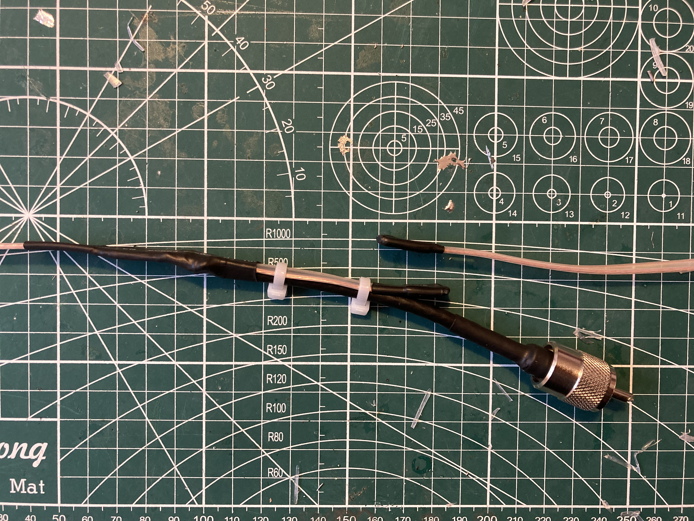
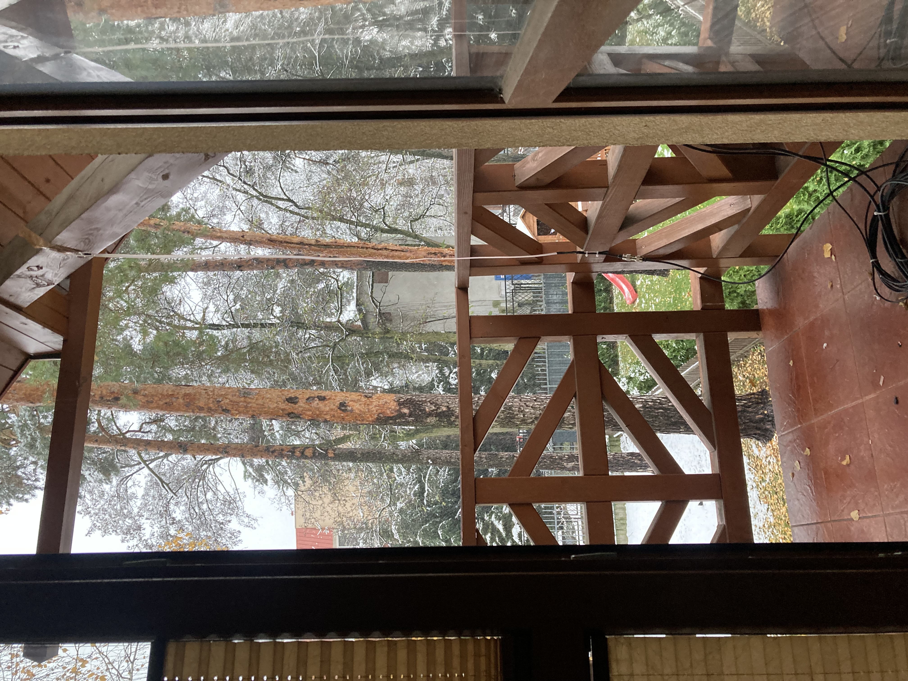

## 2 Meter Slim Jim Antenna Using 300 Ohm Twin-lead
Project based on work of N4UJW and M0UKD and Antenna Design published in 
Polish Swiat Radio.

## Theory of Operation
From [2]:
"The Slim Jim, similar to the J-pole, is in fact a half wave end fed dipole, in the Slim Jim's 
case, an end fed folded dipole. As with all folded dipoles, the currents in each leg are in phase, 
but in the matching stub they in phase opposition, so little or no radiation occurs from the 
matching section (lambda/4 element). You may think how can you say this is a dipole, when its just one element? 
Well, contrary to popular belief, the dipole is so named because it has two electrical poles, 
not two physical poles.
Just like a magnet has two magnetic poles, a North and a South, we have two electrical poles, a Positive 
and a Negative. Being a half wave, there is always two opposite poles on the tips at each half cycle. 
Any half wave antenna is actually a dipole.

A dipole, is usually fed from the centre, where the impedance is about 70Ω. This provides a reasonable 
match to 50Ω coaxial cable, and is why the centre fed dipole is so widely used. A dipole can be fed 
anywhere along its radiator, for example, the windom is 'off centre' fed at the 200Ω point, and an end 
fed half wave will give a very high impedance of up to around 5000Ω.

So, we are feeding this half wave antenna from a high impedance point, which needs to be matched to 
50Ω coaxial cable, and is where the 'J Integrated Matching' (JIM) quarter wave matching section (λ/4) 
comes in. With the Slim Jim, you have the option to select the exact impedance you want, typically 50Ω. 
With the centre fed dipole, you have an impedance of around 70Ω."

According to Professor Rick Matthews from Physics Department of Wake Forest University:
"Electromagnetic waves traveling on transmission lines such as 300 ohm twin lead travel more slowly 
than they do in free space. Typical twin lead has a velocity factor of 0.83, meaning that 
electromagnetic waves travel at 83% the speed of light in a vacuum. However, this is the velocity 
factor for difference mode signals, with the current travelling in opposite directions on the two 
conductors. When used as an antenna, the current travels in the same direction on both conductors, 
the fields are not so concentrated in the insulator, and the velocity factor is much closer to 1.0, 
typically around 0.95."

Applying velocity factor of 0.95 we arrive at exact length of lambda/2 radiator and matching element of
lambda/4 used in based design:

for waveform in free space:

$c=lambda/T$

$c=lambda*f$

$lambda=c/f$

in case of waveform in twin-lead transmission line we need to assume that wave travels with reduced speed 
(by velocity factor):

$lambda=vf*(c/f)$

where:

c - speed of light in free space = 299 792 458 m/s

f - waveform frequency = 144 MHz (one can select exact centre frequency for his/her activity)

c - velocity factor = 0.95 

then:

$lambda=0.95*(299 792 458/144 000 000)=1.98m$

hence:

$lambda/2=0.99mm$

$lambda/4=0.49mm$

## Baseline Design
From [3]:

## Baseline Design Minor Modifications
Sligthly modified design can be seen below:

In my (SP5GW) case I have used 300ohm twin-lead SLX300 line manufactured by Slaska Fabryka Kabli S.A. 
(today NKT Cables). 
Cable has been purchesed on polish e-commerce site allegro from company called: kableprzewody.

I was able to follow all dimensions from baseline design [3] except:

- location of feedline connetion (coax connection). In my case I put it 8.5cm from the bottom of 
    matching lambda/4 element instead of 10cm stated in baseline design.

    I have experimented with other locations as well. I have started with connecting coax 11cm from the 
    bottom of matching element, which resulted in VSWR minimum at f=152MHz. Then I moved feed point 
    to 9cm from the bottom, which gave VSWR minimum at f=147MHz. Finally feed point was moved further down
    to 8.5cm from antenna bottom, which moved VSWR minimum to 146MHz. I believe further shift of feed point 
    down to 8cm could further improve VSWR, but this was not tested since already achieved VSWR levels were 
    below 1.5 for entire 2m band.

    This is in fact how this type of antenna is tunned. Based on my experience reducing radiating or matching 
    elements length is not as effective when tuning VSWR as mvoing antenna feed point.

- I chosen 2cm gap in ribon cable wire connected to coax brain.

- I used H-155 coax instead of RG-58 mentioned typically in case of this antenna design 
    common on the internet (no particular reason for this selection - I had it available). 

## Assembly Process

Step 1: Cut antenna cable to the length of 152cm (leave 1 cm at each end to allow soldering).

Step 2: 49cm above the bottom of the antenna cut a gap of 2cm (remove only one of the 2 cable wires!).
    

    
    

Step 3: Solder both wires at each antenna's end. 

Step 4: Expose both wires at the level of 10cm (+/- 2cm i.e. total of 4cm) 
    Try to leave as much plastic between wires as possible to keep cable structural integrity
    To stabilize the cable further try to solder exposed wires

Step 5: Attach coax to twin-lead cable and test VSWR
    Coax braid shall be connected to twin-lead wire with gap
    Coax inner wire shall be connected to twin-lead wire without a gap
    

    
    

Step 6: Fasten coax to twin-lead cable and protect open wires with heat shrink.
    

    
    

## Measurement results

VSWR and Impedance measured with NanoVNA. Actual results did not differ significantly between different antenna
locations. Care was taken in all cases to have antenna installed far from metal objects.

Further VSWR optimization was possible, but abandoned since achieved results were already very good 
(VSWR<1.4 for entire 2m band).

Red Marker set to 144MHz, Blue Marker indicating 146MHz.

## Field Tests

I have successfuly made several QSO's with local stations (located in less then 10km away). I have also 
successfuly opened SR5W repeater located about 17km away from QTH. Transmitted power on all ocassions was
within QRP range (about 5W). Antenna was installed in less then ideal location (see picture below). 

I would expect evem greater results if antenna was elevated to the rooftop level.

Based on achieved performance I would recommend this design for both basestation setup and on the move 
antenna, which is ultra light and easy to carry.

# References
[1] https://www.hamuniverse.com/2meter300ohmslimjim.html

[2] https://m0ukd.com/calculators/slim-jim-and-j-pole-calculator/

[3] Swiat Radio, Polish Ham Radio Magazine, issue 11/12/2022, page 36

[4] https://www.matthews.sites.wfu.edu/misc/dipole/velocity.html